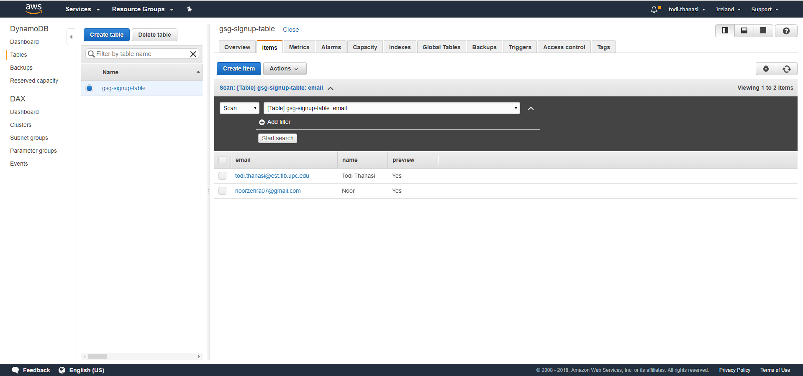
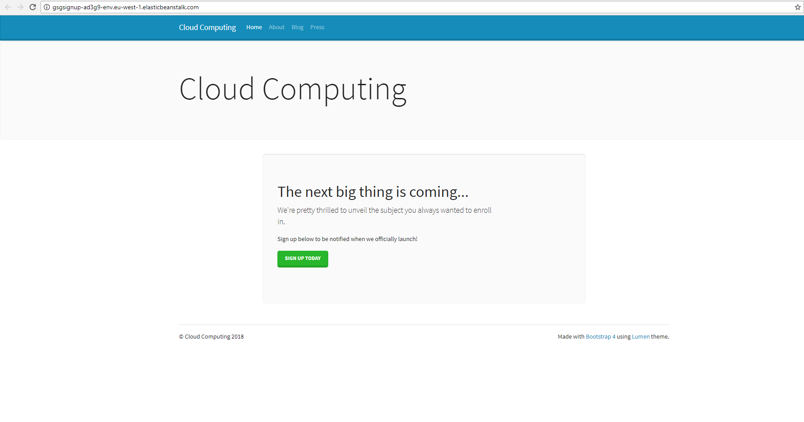

# Lab4 - ReadMe

#### GroupId
1102

#### Members & email
- Syeda Noor Zehra Naqvi         <syeda.noor.zehra.naqvi@est.fib.upc.edu>
- Todi Thanasi                   <todi.thanasi@gmail.com>
                         
#### Github url
https://github.com/todithanasi/CLOUD-COMPUTING-CLASS-2018/tree/master/Lab4

#### Django Express Signup URL
https://github.com/todithanasi/eb-django-express-signup

Following is the Screenshot of DyanmoDB table with the data of the new leads.

Following is the screenshot of the deployed website on the cloud.

#### Terminating EC2 Instance:

When we terminated EC2 Instance first, EBS tried finding the cloud instance and since it didn't find one, it created a new instance. So in EC2 console there was a new instance running besides the terminated one.
What happened is that EBS services thinks that something went wrong with the instance in EC2 and that's why it creates a new one after some time to keep offering the service.

#### Terminating environment from EBS:

When we terminated from EBS console first, it terminates the instance in EC2 as well. So it's a proper termination. 
This happened because the reason why EC2 instance was created, is because EBS service needed it, and that's why terminating from EBS, terminates EC2 instance as well.
