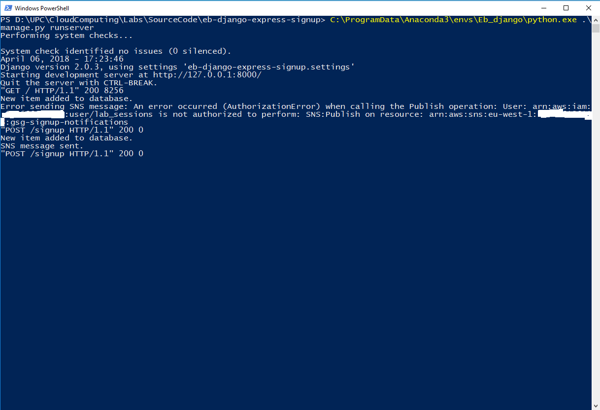
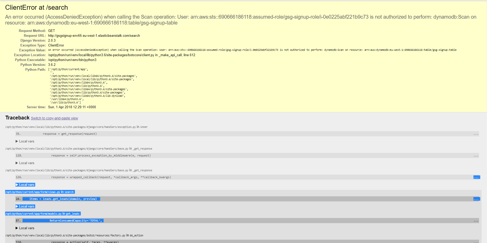
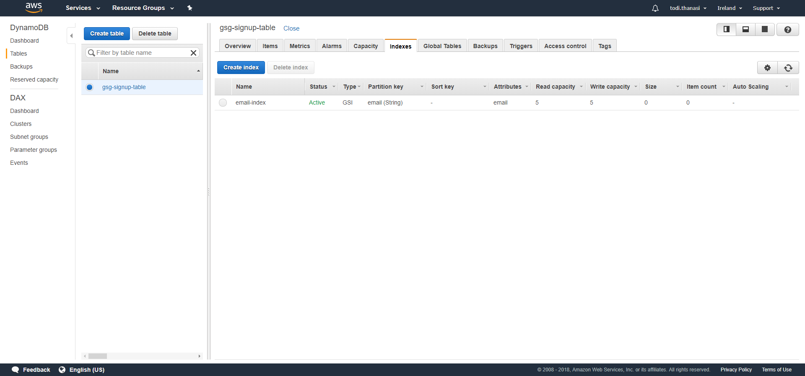
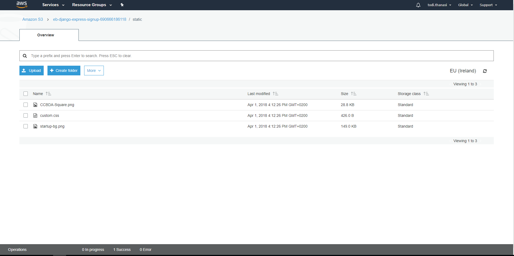
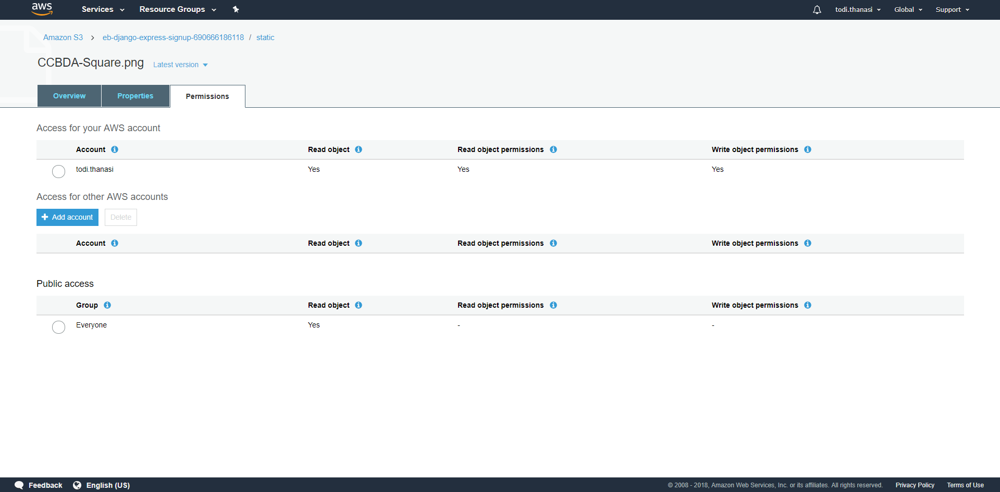
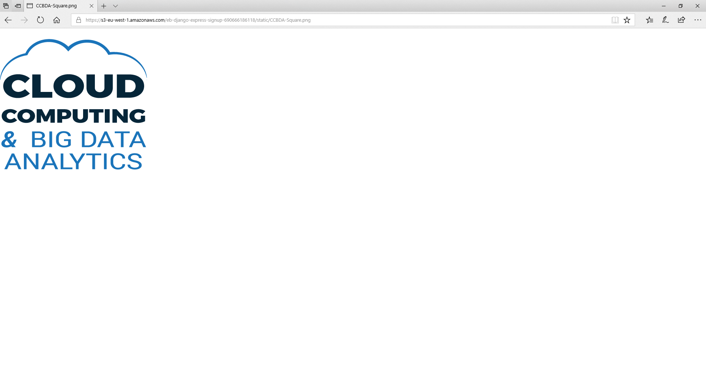
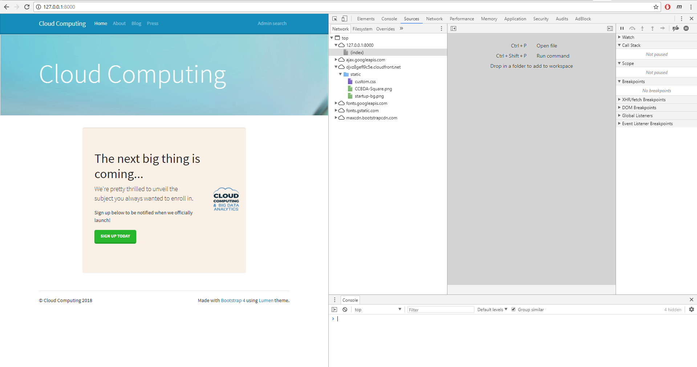
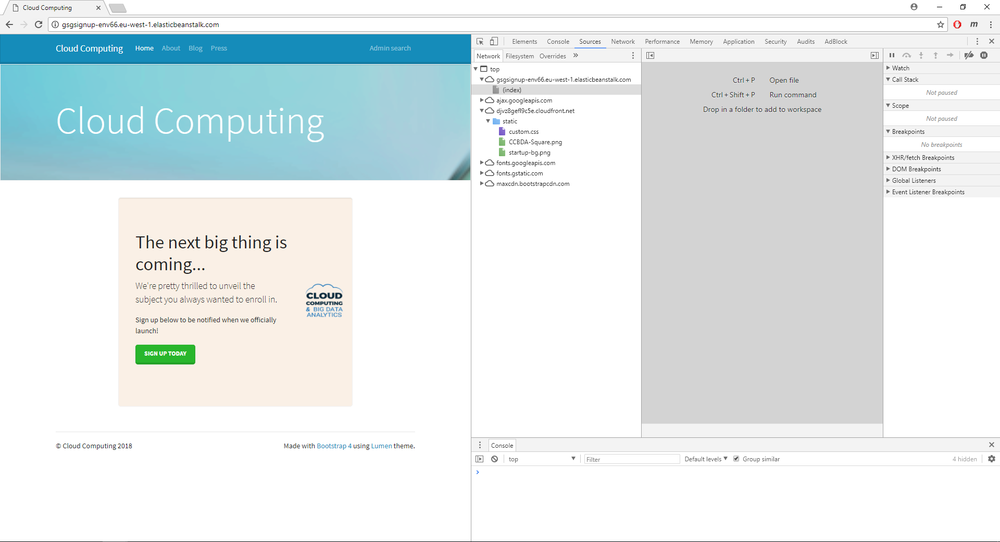

# Lab5 - ReadMe

#### GroupId
1102

#### Members & email
- Syeda Noor Zehra Naqvi         <syeda.noor.zehra.naqvi@est.fib.upc.edu>
- Todi Thanasi                   <todi.thanasi@gmail.com>
                         
#### Github url
https://github.com/todithanasi/CLOUD-COMPUTING-CLASS-2018/tree/master/Lab5

#### Task 5.1
Q51: Has everything gone alright?

In the beginning, due to the fact that we were using the new user account (lab_sessions), we received an error for lack of permissions to use sns service. 
After adding the permission in the IAM using console, everything went fine and the email notification was sent successfully. This can be noticed in the second attempt in the below image.

#### Task 5.2
Q52: Has everything gone alright? What have you changed?

Initially we recieved an error as in the attached image because reading from the exception, the user has no permission to scan the table.

In order to resolve this we added scan permissions to the policy attached to the role. This can be seen in the screenshot below.

#### Task 5.3
Q53: Describe the strategy used to fulfill the requirements of this section. What have you changed in the code and the configuration of the different resources used by the web app? What are the tradeoffs of your solution?

For this task, to optimize the data retrieval, instead of getting all the columns of the table, we only fetched the email column as we only needed this to fill the dropdown menu with the domain names of email. In addition to that we also created a secondary index for the column email.
Following is the screenshot of it: 

As in dyanamo DB regex and substring concept does not exist for data fetching, we have to fetch the whole email column and not just the domain part of the email which is a tradeoff.  
We also think another solution to optimize this data retrieval is to create an extra table with two columns (domain and counter) and with each insertion check the domain part of email and add the new domain names with counter 1 and increment the counter for existing domain names.
And then to fill the dropdown menu, directly query data from this new table instead of the table containing all the data. This solution will bring a tradeoff that at the time of data insertion we need to parse email check for domain and takecare of insertion in another table as well.
For the scope of this lab we only implemented to fetch email column only and did not add any additional table.

#### Task 5.4

Q54: Take a couple of screenshots of you S3 and CloudFront consoles to demonstrate that everything worked all right.

Below are the screenshots showing the files that were uploaded in the S3 bucket and then configured to be served as static contenct by using CloudFront service of amazon. 
In the screenshots it can be seen that we deployed both locally and on cloud with success.

Q55: How long have you been working on this session (including the optional part)? What have been the main difficulties you have faced and how have you solved them?

We spent 6 hours on this lab session including the optional part. Most of the time was invested in the optional part as we had to investigate how Dynamo DB works and what functionalities it offers. No extra difficulty was encountered besides this.

