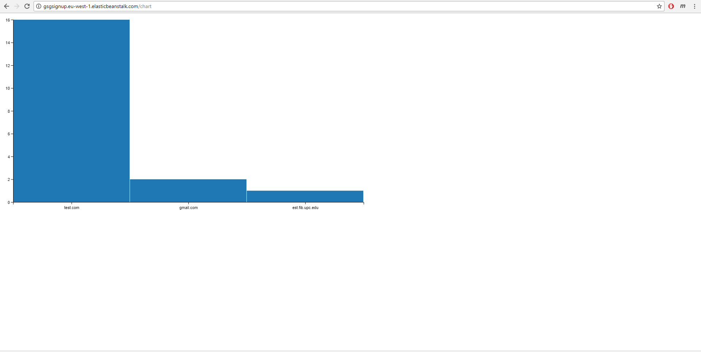
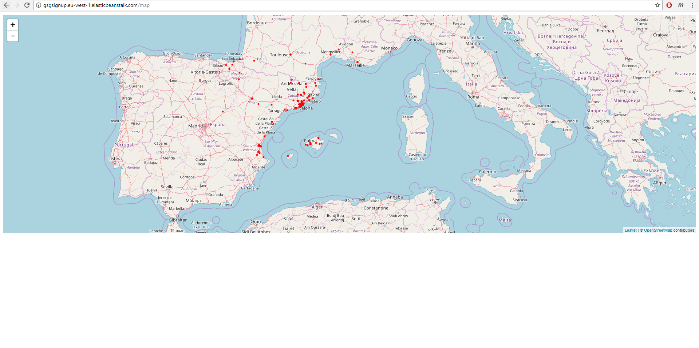
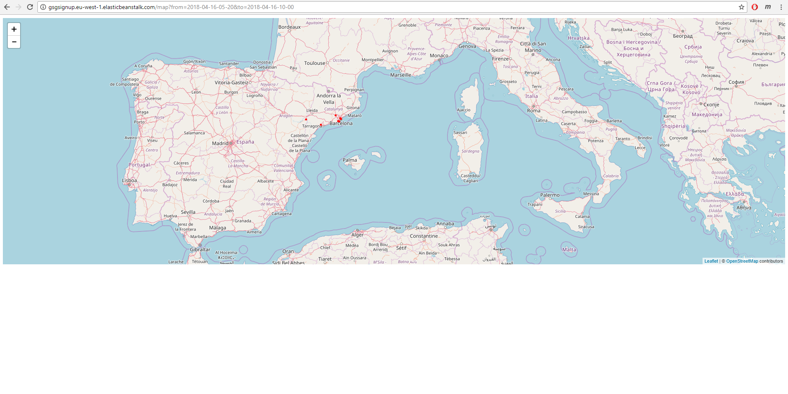
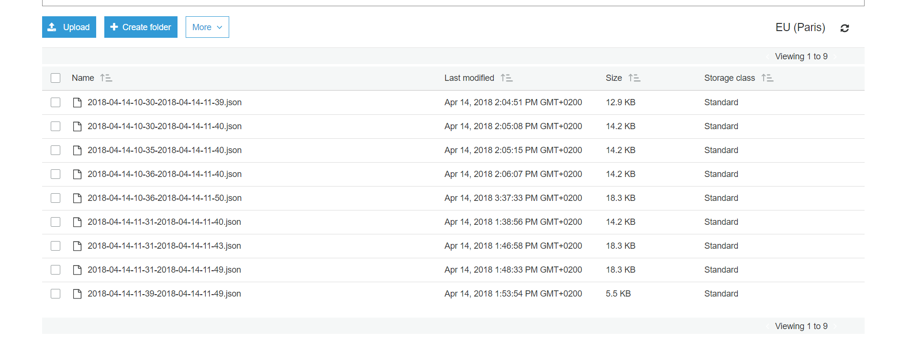

# Lab6 - ReadMe

#### GroupId
1102

#### Members & email
- Syeda Noor Zehra Naqvi         <syeda.noor.zehra.naqvi@est.fib.upc.edu>
- Todi Thanasi                   <todi.thanasi@gmail.com>
                         
#### Github url
https://github.com/todithanasi/CLOUD-COMPUTING-CLASS-2018/tree/master/Lab6

#### Task 6.1
Q61a: Having domain_freq.json written as static content is not the best way to distribute it because different clients can invoke different parameters simultaneously? Can you use S3 to solve the problem? Write the changes in the code and explain your solution?
Answer: We did not save the data into a JSON file because the content is dynamic and is changing on every call. We implemented the solution differently, instead of saving the file we are sending to the chat.html page a JSON object and parsing it there.
Q61b: Once you have your solution implemented publish the changes to EB and try the new functionality in the cloud. Did you need to change anything, apart from the code, to make the web app work?
Answer: No. Nothing was needed to be changed in order to make the application work in EBS beside re-deploying after running the freeze command to update the requirements.txt file. 



#### Task 6.2


Q62a: Now we are showing all the collected tweets on the map. Can you think of a way of restricting the tweets plotted using some constraints? For instance, the user could invoke http://127.0.0.1:8000/map?from=2018-02-01-05-20&to=2018-02-03-00-00. Implement that functionality or any other functionality that you think it could be interesting for the users.
To restrict the tweets on map on a date range , we saved the date as timestamp strings as there is no concept of date range comparison in Dyanamo DB. we took the parameter values of to_date and from_date from url, converted them to timestamp as well and compared them to filter the required date range tweets.


Q62b: Make the necessary changes to have geo_data.json distributed using S3, or the method you used for the above section. Publish your changes to EB and explain what changes have you made to have this new function working.
To distribute the geo_data.json, we saved it to s3 bucket and accessed it from s3 bucket. We also implemented caching by saving a file like '2018-04-14-10-30-2018-04-14-11-39.json' using query string in url and every time check if this file exist already, if yes just use that file otherwise fetch the data from database and create this file and then load data.
This reduces the query load to database. 


To allow application to access s3 bucket, we edited IAM role to add permissions to read and write in the s3 bucket. 
We also changed CORS configuration of the bucket to allow cross origin requests.

```
<?xml version="1.0" encoding="UTF-8"?>
<CORSConfiguration xmlns="http://s3.amazonaws.com/doc/2006-03-01/">
<CORSRule>
    <AllowedOrigin>http://*</AllowedOrigin>
    <AllowedOrigin>https://*</AllowedOrigin>
    <AllowedMethod>GET</AllowedMethod>
    <MaxAgeSeconds>3000</MaxAgeSeconds>
    <AllowedHeader>Authorization</AllowedHeader>
</CORSRule>
</CORSConfiguration>
```

Q62c: How would you run TwitterListener.py in the cloud instead of locally? Try to implement your solution and explain what problems have you found and what solutions have you implemented.

For TwitterListener.py, we created a new view in the views.py file which has its own URL (domainName:8000/twitter) in the url.py file with the same concept utilized for the maps and chart features. When this URL is called, a subprocess is initiated that executes the python code which can be found in the TwitterListener.py file, which streams tweets and stores them in DynamoDB. The implementation does not stop the original application from running and allows the user to stop the process upon request. This can be done by implementing a stop button which will be part of the twitter.html page and will allow the user to kill the process gracefully without stopping the wep application.
We know that decoupling is important, and to make it further modular we can separate the twitter listener from the web application completely as they only use a common database, and there is no further interaction needed. TwitterListener will act as a small microservice inserting tweets in the database independent of everything else. The web application will fetch data from database or s3 bucket files depending on the availability as it is doing now as well. 
