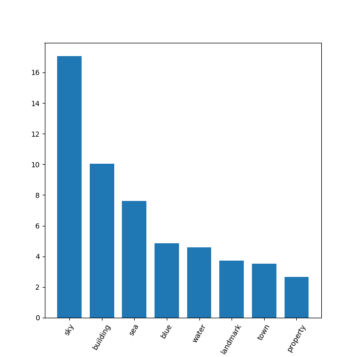
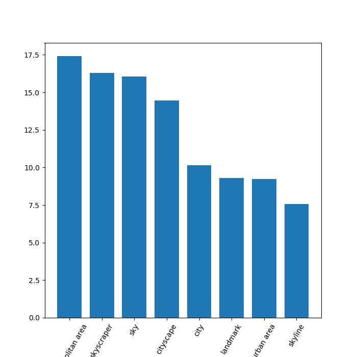

# Lab6 Optional part - ReadMe

#### GroupId
1102

#### Members & email
- Syeda Noor Zehra Naqvi         <syeda.noor.zehra.naqvi@est.fib.upc.edu>
- Todi Thanasi                   <todi.thanasi@gmail.com>
                         
#### Github url
https://github.com/todithanasi/CLOUD-COMPUTING-CLASS-2018/tree/master/Lab6a

#### Task 6.3

Q63: What problems have you found developing this section? How did you solve them?

We used flickr api to get the images of a user and analyse them using google cloud vision api. Flickr api is very vast so we did not face any problems with it's api. However, using the flickr api the information we get is what kind of pictures this user posts (nature, buildings, food etc).
If we use instagram or another social media platform's api, it will give better results regarding the person, and not jsut what kind of pictures they take. However, the code will be similar, it will just require switching flickr api call with another api call.
One problem that we faced regarding dynamo db is the error 'ProvisionedThroughputExceededException'. This can be solved by increased the configured throughput for the table, however than we also have to pay more. Programatically the solution we applied is whenever this error comes up, we sleep the program for 5 seconds before making the next request. 
The other problem regarding Google vision api was sometimes, the api fails to put any labels for the image and then we get an error that labelAnnotation has no value. To fix this problem we added the following check to only process if there is some classification:

```
if response_vision['responses'] and 'labelAnnotations' in response_vision['responses'][0]:
	....
```
In dynamo db we saved the base64 encoded string of the image, and the whole json of labelAnnotations incase we need anything else in the future. 
We used matplotlib to plot the bar graphs. We took sum of all the weights of the same tags of all the pictures, and plotted the top 8 tags with heighest sum value. 
Following is the image of one of the bar graphs of user account lfcastro:


For another acount iweatherman:


Q64: How long have you been working on this session ( the optional part)? What have been the main difficulties you have faced and how have you solved them?

We have spent 8 hours on this lab session. It was mainly the revision of the previous labs, but understanding the google cloud vision api and flickr api were the new concepts for us.
We also spent some time figuring out the main problems that we faced which are mentioned above.
