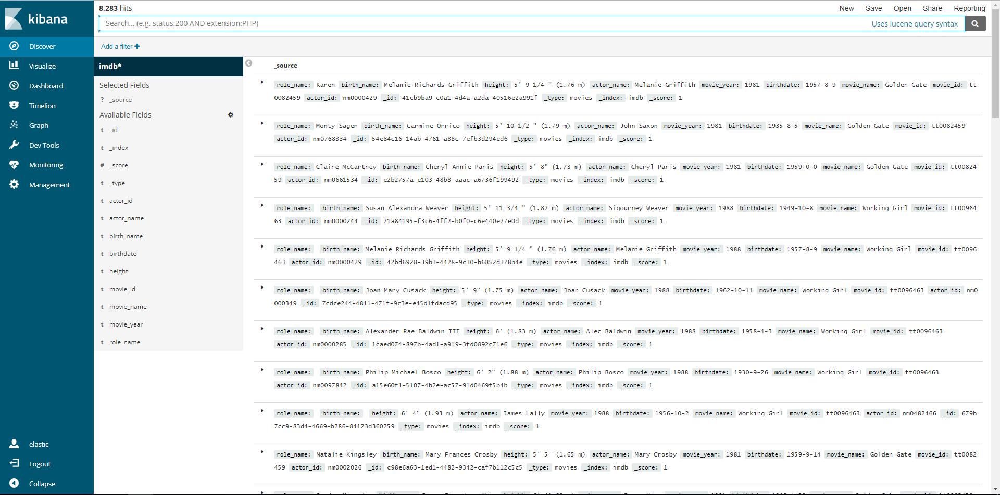
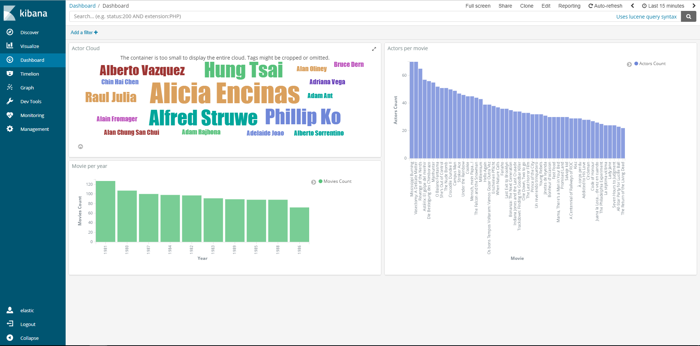
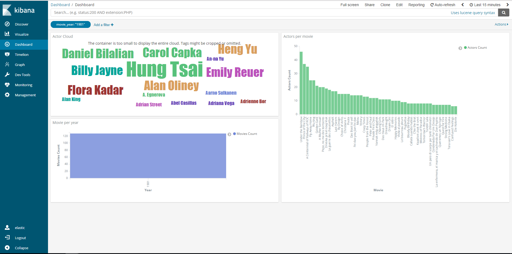
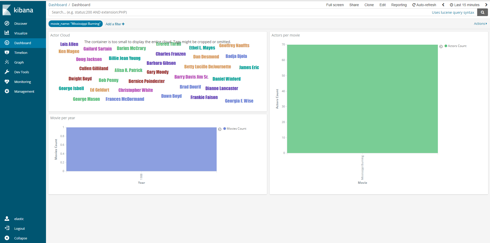
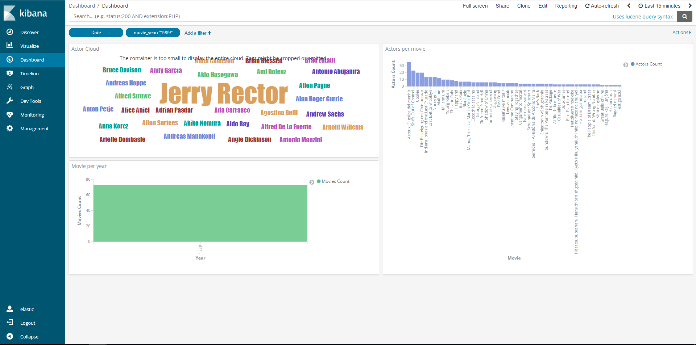

# Lab7 - ReadMe

#### GroupId
1102

#### Members & email
- Syeda Noor Zehra Naqvi         <syeda.noor.zehra.naqvi@est.fib.upc.edu>
- Todi Thanasi                   <todi.thanasi@gmail.com>
                         
#### Github url
https://github.com/todithanasi/CLOUD-COMPUTING-CLASS-2018/tree/master/Lab7

#### Scrapy code url
https://github.com/todithanasi/scrapy-lab

#### Task 7.1

Q71: Add the above code to your scrapy-lab repository. Add the nytimes.json, containing the output of your execution, to the Lab7 folder of your answers repository. 

Answer: The generated json file for the nytimes can be accessed by following this [link](nytimes.json).

#### Task 7.2

Q72: Add the code of the new spider your scrapy-lab repository. Add the imdb.json, containing the output of your execution, to the Lab7 folder of your answers repository. 

Answer: The generated json file for the imdb can be accessed by following this [link](imdb.json).

#### Task 7.3

Q73: Take a screenshot of the Kibana Dashboard showing the above plots without filters. Set a couple of filters, take screetshots. 

Answer: We run our application until we collected around 8200 records. 



We build 3 visualization charts and placed them in a Dashboard to answer the below question. 



We applied 2 different filters and noticed that the result was changing accordingly.
The first filter was to show only movies of year 1981.



The other filter was to show only movies information related to the movie "Mississippi Burning".




Q74: Build your own query and explain what you have done.

Answer: We enriched the previous retrieved information in order to give answer to other questions. We coded another function inside the same crawler which is calling the bio website of each actor and is accessing information about "height", "birthdate" and "birth name". 

The question that we want to answer is: Who are the actors which where born after a specific date (01-01-1950) for all the movies of 1989?

In order to give answer to this question we used the new retrieved field of "birthdate" and build a custom filter in Kibana by using a range function as below.

```
{
  "query": {
    "bool": {
      "filter": [
        {
          "range": {
            "birthdate": {
              "gte": "1950-01-01"
            }
          }
        }
      ]
    }
  }
}
```
We used the same dashboard to plot the result after applying our filter. The below image is the result of our query.




Q75: How long have you been working on this session? What have been the main difficulties you have faced and how have you solved them? 

Answer: This session was one of the longest of the cloud computing labs in terms of invested working hours. We have been working in total around 12 hours per person in order to develop the code and give answer to the lab questions. The main difficulties were encountered while working with scrapy. We invested time to get familiar with scrapy since it was the first time we use this library. The online documentation of scrapy was the source to overcome the encountered issue. Regarding the use of Elastic Search and Kibana tools, we did not encounter any big issue while working with them. 